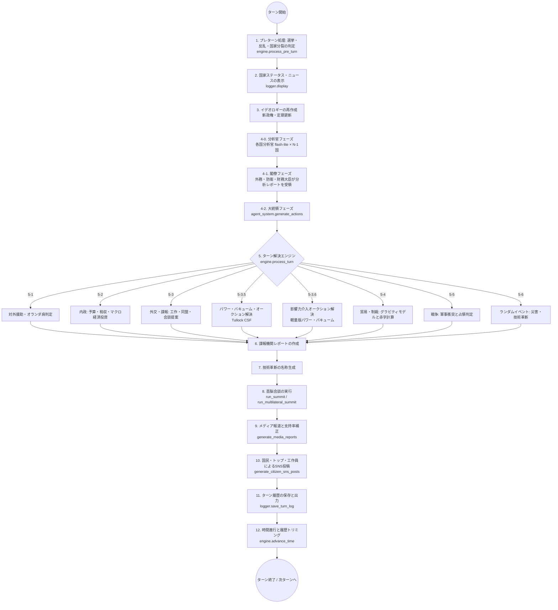

# AI Diplomacy Simulation: An Agent-Based Model of International Relations

## 1. Overview (概要)

### 1.1. Purpose (目的)
本システムは、大規模言語モデル（LLM）を国家元首や政府の意思決定中枢（エージェント）として見立て、多国間における外交・内政・戦争・諜報活動をシミュレーションするためのマルチエージェント型エージェントベースモデル（ABM: Agent-Based Model）である。
従来の固定的なルールベースや推論アルゴリズムに基づくゲームAIとは異なり、高い自然言語推論能力と知識を持つLLMに対し、各国のペルソナ（イデオロギー、政治体制、経済・軍事力などの初期状態）を付与し、毎ターンの複雑な戦略を自律的に決定させる。
これにより、生成AIのゲーム理論的挙動や「仮想的な国際関係学」を観察・分析するためのテストベッドを提供することを目的とする。

### 1.2. LLMモデルのタスク割り当て (LLM Capabilities)
システムの自律性とコストパフォーマンスを両立させるため、役割ごとにGeminiの各モデルが動的にアサインされる。

*   **国家首脳決裁（大統領） (`gemini-2.5-pro`)**: 4閣僚から上がってきた政策案（予算要求と外交・内政の方針）を統合・調整し、国家予算全体を再計算しながら最終決裁を下すため、最も推論能力と論理的調整力が要求されるコア・エンジン。
*   **各国分析官（Country Analyst） (`gemini-2.5-flash-lite`)**: 対象国ごとに1体ずつ起動され、外交・軍事・経済の3観点から包括的な分析レポートを生成する「情報分析官」。このレポートは外務大臣・防衛大臣・財務大臣の3者に通達され、各大臣の判断材料となる。DB検索ツール（RAG）を使用可能であり、各国に特化した深い分析が期待される。呼出し回数は各国 $N-1$ 回（$N$ = 参加国数）で、全体では $O(N^2)$ でスケーリングする。
*   **閣僚起案（外務・防衛・経済内務・財務大臣） (`gemini-2.5-flash`)**: 分析官レポートと各省庁の利害・状況（ニュース・自国ステータスなど）を基に草案を作成する。外務・防衛・財務大臣は分析官からの各国レポートを受け取り、経済内務大臣はマクロ経済全体の判断を行う。メモリ使用量を削減するため、4大臣は**逐次実行**される（外務→防衛→経済内務→財務の順）。
*   **メディア・諜報機関レポート (`gemini-2.5-flash`)**: 発生したイベントや工作結果からのニュース記事生成、ならびにスパイ活動や破壊工作後の機密文書の要約・抽出作業。
*   **国民タイムライン・技術革新・マニフェスト生成 (`gemini-2.5-flash-lite`)**: 国民のSNSへの感情的な投稿生成、政権交代時のマニフェスト・イデオロギー生成、ランダム発生する次世代産業技術（GPTs）の名前空間定義など、即応性が求められる大量のサブタスク。
*   **感情分析 (`gemini-2.5-flash-lite`)**: SNS投稿やメディア記事の感情スコア（-1.0〜+1.0）を算出。政治・外交ドメインの文脈理解を活用し、支持率WMAモデルの入力として使用。
*   **首脳会談 (`gemini-2.5-pro`)**: 2国間または多国間の首脳対話（最大4ラウンド）と合意事項の要約。多国間会談ではラウンドロビン方式で全参加国が順番に発言する。高度な対話能力と文脈保持力が求められるため、大統領と同じProモデルを使用。

### 1.3. Entities, state variables, and scales (エンティティ、状態変数、スケール)

#### 1.3.1. Entities (エンティティ)
*   **国家 (Country):** 独立した意思決定主体。内政、外交、軍事、諜報などの各種ステータスを保持する。
*   **世界状態 (World State):** すべての国家の状態、国家間の関係性（同盟、戦争など）、およびグローバルなイベント（災害など）を包含するシステム全体の状態。
*   **同盟 (Alliance):** 国家間で結ばれる軍事同盟。**相互合意メカニズム**に基づき、一方が提案（`propose_alliance`）しても、相手側が同ターンまたは翌ターンに同じく提案を行うまで成立しない。未応答の場合、提案は翌ターン終了時に自動的に失効する。
*   **戦争 (War) / 貿易協定 (Trade Agreement) / 制裁 (Sanction):** 国家間で結ばれたその他の外交的ステータス。
*   **初期関係設定 (`data/initial_relations.csv`):** シミュレーション開始時の国家間関係を定義するCSVファイル。各行で2国間の関係タイプ（`alliance`/`neutral`/`at_war`）、貿易協定の有無、経済制裁の方向、戦争の攻撃側を指定できる。CSVに記載のないペアはデフォルトで `neutral`（中立）として初期化される。

#### 1.3.2. State Variables (状態変数)
*   **基本属性:** 国名、政治体制 (Democracy, Authoritarian)、イデオロギー。
*   **国力・経済指標:** 経済力 (総GDP $Y$)、**1人当たりGDP (GDP per capita)**、政府予算 ($G$)、軍事力 ($M$)、諜報レベル ($IL$)、国家累積債務 (National Debt)、税率 (Tax Rate)。
*   **社会的・人口指標:** 政府支持率 ($\alpha$, 0%〜100%)、潜在的反乱リスク (Rebellion Risk)、報道の自由度 (Press Freedom)、**総人口 (Population)**、**生産年齢人口比率 (Working Age Ratio)**。
*   **教育・科学水準 ($H$):** 人的資本の蓄積レベル (Initial: 1.0)。内生的成長理論に基づき、GDP産出の効率を高める。
*   **国土面積 (Area):** 災害等の発生確率にバイアスを与える地理的スケール値。地球の総陸地面積は $148,940,000$ km² と定義される。
*   **エネルギー関連フィールド（v1-2追加）:**
    *   `energy_self_sufficiency` (float, 0.0〜1.0): 国内生産でまかなえるエネルギー比率。0.13 = 13%が自給。
    *   `energy_reserve_target_turns` (float): 通常時の目標備蓄量（ターン数単位）。例: 2.8 = IEA基準の90日相当（四半期換算）。
    *   `energy_reserve_turns` (float): 現在の備蓄残量（ターン数単位）。初期値は `energy_reserve_target_turns` と同一。
    *   `energy_export_blocked` (bool): 海峡封鎖等でこの国からのエネルギー輸出が停止されているか。
    *   `energy_import_sources` (dict): `data/energy_import_sources.json` から初期化。輸入元とその供給割合のマッピング。

#### 1.3.3. Scales (スケール)
*   **時間スケール:** シミュレーションは離散的な「ターン (Turn)」単位で進行し、1ターンは四半期（3ヶ月）に相当する。

### 1.4. System Processing Flow (処理フロー)
シミュレーションの1ターン（`main.py` および `engine` パッケージ）は、以下の厳密なフェーズ順序で解決される。



---

## 2. Details (詳細サブモデルと数式定義)

以下に、システムの状態遷移を司る中核的な数理・論理モデルの詳細パラメータおよび計算式を記述する。これらのルールにより、このドキュメントからシミュレーション・エンジンの完全なリバースエンジニアリングが可能である。

### 2.1. 内政と政策実行力モデリング (Domestic & Execution Power Model)

国家の投資計画の実現可能性は、国家の**政策実行力 (Execution Power: $\epsilon$)** に依存する。

#### 政策実行力 $\epsilon$ の算出 (エンジン定数)
*   `DEMOCRACY_WARN_APPROVAL = 40.0`
*   `CRITICAL_APPROVAL = 15.0`

政治体制が「民主主義 (Democracy)」の場合、政府支持率 $\alpha$ に強く依存する。
$$
\epsilon(\alpha) = 
\begin{cases} 
1.0 & (\alpha \ge 40.0) \\
\max\left(0.0, \frac{\alpha - 15.0}{25.0}\right) & (\alpha < 40.0) 
\end{cases}
$$

政治体制が「専制主義 (Authoritarian)」の場合、体制の強権性を反映し、支持率が低くても一定の執行力（最低値 $0.5$）が保証される。
$$
\epsilon(\alpha) = 
\begin{cases} 
1.0 & (\alpha \ge 25.0) \\
\max\left(0.5, 0.5 + \frac{\alpha}{50.0}\right) & (\alpha < 25.0) 
\end{cases}
$$

計算された $\epsilon$ が、政府支出の各項目 ($G_{econ}, G_{mil}, G_{wel}, G_{intel}$) に乗算され、投資の実行効果が減衰する。
$$G_{econ} = Budget \times InvEcon \times \epsilon, \quad G_{mil} = Budget \times InvMil \times \epsilon, \quad G_{wel} = Budget \times InvWel \times \epsilon, \quad G_{intel} = Budget \times InvIntel \times \epsilon, \quad G_{edu} = Budget \times InvEdu \times \epsilon$$
※ 上式における $Budget$ は §2.2 で算出される実質政府予算、$InvEcon, InvMil, InvWel, InvIntel, InvEdu$ はLLMが決定する投資割合（合計1.0に正規化済み）を表す。

#### 増額・減税ペナルティとボーナス (Tax Penalty and Bonus)
*   `TAX_APPROVAL_PENALTY_MULTIPLIER = 200.0`
*   `TAX_REDUCTION_APPROVAL_BONUS_MULTIPLIER = 100.0`
前ターンより税率（$Tax Rate$）を上昇させた場合、政治的コストとして即座に支持率が低下する。
$$ \Delta Approval = -(\Delta TaxRate \times 200.0) $$
例: 税率を10% ($0.1$) 引き上げた場合、支持率は $-20.0\%$ 低下する。

逆に税率を引き下げた場合、国民の負担軽減効果として即座に支持率に還元されるボーナスが発生する。
$$ \Delta Approval = +(|\Delta TaxRate| \times 100.0) $$
例: 税率を2% ($0.02$) 引き下げた場合、支持率は $+2.0\%$ 上昇する。

### 2.2. マクロ経済モデル (SNAベース: Y = C + I + G + NX)

本システムは現実の国民経済計算（SNA）に基づく**総需要主導マクロ経済モデル**を採用している。

1.  **政府予算 ($G$)**:
    *   次期の税収推定 ($T_{est}$) = 前期GDP ($Y_{t-1}$) $\times \text{Tax Rate}$
    *   利払い = $\text{National Debt} \times 0.01$ (`DEBT_INTEREST_RATE = 0.01`)
    *   実質政府予算 = $T_{est} - \text{利払い}$ (マイナスの場合は $0.0$)
2.  **民間消費 ($C$)**:
    *   `DEMOCRACY_BASE_SAVING_RATE = 0.25`
    *   `AUTHORITARIAN_BASE_SAVING_RATE = 0.30`
    *   福祉投資 ($InvWel$) により民間貯蓄率 $s$ が低下する（消費指向になる）。
    *   $s = \max(0.15,\ \text{BaseSavingRate} - InvWel \times 0.15)$
    *   $C_{base} = (Y_{t-1} - T_{est}) \times (1 - s)$
    *   減税時のみ、消費活性化ボーナスが乗算される（$C = C_{base} \times (1.0 + |\Delta TaxRate| \times 2.0)$）。増税時は $C = C_{base}$。
3.  **民間投資 ($I$)**:
    *   民間貯蓄 $S_{private} = (Y_{t-1} - T_{est}) - C$
    *   `GOVERNMENT_CROWD_IN_MULTIPLIER = 0.3` (インフラ投資等による民間投資誘発)
    *   `GOVERNMENT_CROWD_OUT_MULTIPLIER = 0.1` (軍事費増大による民間投資の抑制)
    *   $I = \max(0.0,\ S_{private} \times 0.85 + G_{econ} \times 0.3 - G_{mil} \times 0.1)$
4.  **経済成長：人的資本（PWT HCI）と内生的成長**:
    *   本シミュレーションは、Penn World Table 人的資本指数（PWT HCI）を経済成長の「増幅係数」として採用している。
    ### マクロ経済モデル (SNAベース)
GDPの決定式は、限界効用逓減を伴うMankiw-Romer-Weil型の教育バフと、Romer型の内生的成長（基本成長率のアドオン）のハイブリッド形式を採用しています。

$$Y_t = (C + I + G) \times H_{capped} \times (1 + Growth_{endogenous}) + NX$$

- $Y$: 実質GDP
- $C$: 民間消費 ($C = Y \times (1 - 税率) \times (1 - 貯蓄率)$)
- $I$: 民間投資 (Breakthroughによるバフが乗る)
- $G$: 政府支出
- $NX$: 純輸出 (他国との貿易収支)
- $H_{capped}$: PWT HCIに基づく人的資本バフ ($1.0 + \log_2(\max(1.0, \frac{HCI_t}{HCI_{initial}})) \times 0.05$)
- $Growth_{endogenous}$: 教育・科学投資比率による内生的追加成長率 ($\log_{1p}(\frac{G_{edu}}{Y_{t-1}} \times 10.0) \times \alpha_{endo}$)
- $\alpha_{endo}$: 内生的成長ボーナス係数 (ENDOGENOUS_GROWTH_ALPHA = 0.05)

#### Penn World Table 人的資本指数（PWT HCI）の算出
[学術的根拠] Penn World Table 11.0 (Feenstra, Inklaar & Timmer 2015), Hall & Jones (1999), Psacharopoulos (1994)

$$HCI = e^{\phi(s)}$$

$s$ = 平均就学年数（Mean Years of Schooling: MYS）、$\phi(s)$ はミンサー方程式に基づく区分線形収益率関数:

$$\phi(s) = \begin{cases} 0.134 \times s & (s \le 4) \\ 0.134 \times 4 + 0.101 \times (s - 4) & (4 < s \le 8) \\ 0.134 \times 4 + 0.101 \times 4 + 0.068 \times (s - 8) & (s > 8) \end{cases}$$

*   `MINCER_RETURN_PRIMARY = 0.134` (初等教育0-4年)
*   `MINCER_RETURN_SECONDARY = 0.101` (中等教育5-8年)
*   `MINCER_RETURN_TERTIARY = 0.068` (高等教育9年目以降)

#### 投資による平均就学年数（MYS）の更新
[学術的根拠] Jackson et al. (2016, QJE): 教育支出10%増 → 完了就学年数 +0.27~0.43年

$$MYS_t = MYS_{t-1} \times (1 - 0.001) + \ln(1 + \frac{G_{edu}}{Y_{t-1}} \times 10.0) \times 0.04$$
- $G_{edu}$: 政府の教育・科学投資額
- 0.001: MYSの四半期あたり自然減衰率（年0.4%。退職・知識陳腐化）
- 0.04: 教育投資のMYS増加効率 (`MYS_GROWTH_RATE`)
- MYS更新後、$HCI = e^{\phi(MYS)}$ を再計算してモデルに反映

*   **初期値設定（Barro & Lee 2013, PWT準拠）**:
    | 国       | 平均就学年数 (MYS) | **PWT HCI** |
    | :------- | :----------------- | :---------- |
    | 中国     | 10.8年             | **2.600**   |
    | 台湾     | 12.2年             | **3.500**   |
    | アメリカ | 13.7年             | **3.774**   |
    | 日本     | 13.4年             | **3.500**   |
5.  **国家債務と経済ペナルティ**:
    *   `DEBT_TO_GDP_PENALTY_THRESHOLD = 1.0` (債務の対GDP比100%)
    *   国家累積債務がGDPの100%を超過した場合、過剰な利払い負担による警告（システムログへの記録）が行われる。※以前存在したGDP成長率への直接的なマイナス補正（強制最大5%カット）は、利払いとの二重ペナルティになっていたため廃止された。
5.  **福祉ボーナスによる支持率還元**:
    *   福祉への投資割合から、対数曲線を描いて支持率ボーナス（最大 $+2.5\%$ 程度）が算出され、支持率WMA（加重移動平均）モデルに加算される。
    *   $WelfareBonus = (\ln(1 + InvWel \times 5.0) \times 1.5 - 1.0) \times \epsilon$

#### 動的な軍事維持費 (リチャードソン・モデルの疲弊係数)
*   `BASE_MILITARY_GROWTH_RATE = 0.015`
*   `BASE_MILITARY_MAINTENANCE_ALPHA = 0.03`
*   `MAX_MILITARY_FATIGUE_ALPHA = 0.20`
軍事保有ストック ($M$) の維持コストとなる疲弊係数 $\alpha_{mil}$ は、軍事負担率（$Military / GDP$）の二乗に比例して動的に跳ね上がる。**なお、計算に用いるGDPは当ターンの経済更新前の値（前期GDP: $Y_{t-1}$）である。**
$$ \alpha_{mil} = \min\left(0.20,\ 0.03 + \left(\frac{Military}{\max(1, Y_{t-1})} \times 2.0\right)^2\right) $$
次ターンの軍事力は以下のように算出され、$G_{mil}$ は §2.1 で定義した政策実行力 $\epsilon$ 適用後の軍事予算である。過剰な軍拡は維持費の増大により自壊する。
$$ M_{t} = (M_{t-1} \times (1 - \alpha_{mil})) + (G_{mil} \times 0.015) $$

#### 軍事動員の限界ルール（10%の壁）
軍事力は「資本と労働の代替」理論に基づき、1人当たりGDPをベースに実力としての「動員兵力数 ($Personnel$)」に換算される（豊かな国ほど兵器等の資本集約型となり少人数で軍事力を出せる）。
$$ Personnel = \frac{Military}{1人当たりGDP \times 3.4} $$
動員率（$Personnel \div Population$）が歴史的限界である **10%** を超えた場合、労働市場からの強制徴用による「産業空洞化ペナルティ」として民間投資・消費が最大 5.0 倍の規模で抑制されクラウドアウトを引き起こす。また、強制動員への反発で支持率が激減する。

### 2.3. 人口動態と社会不安モデル (Demographic Transition & Social Unrest Model)
各国の人口増減は、出生率と死亡率という2つのマクロ関数の差分（自然増減）に基づく。さらに本システムでは以下の数理モデルを採用し、無限論理ではなく面積と経済に対する制約を課している。

#### ロジスティック方程式と環境収容力 ($K$)
*   人口増加率はマルサス的（無限）な成長ではなく、国土面積に基づく環境収容力（$K = Area \times 150.0 \div 1,000,000$）に制約される**ロジスティック成長モデル** ($ \frac{dN}{dt} = rN(1 - \frac{N}{K}) $) に従う。人口（百万人単位）が $K$（百万人単位）に近づくほど自然増加率はゼロに収束する。
*   **人口過密（Overpopulation）ペナルティ**: 人口が環境収容力 $K$ の90%を超過すると、インフラや住宅の逼迫により**強力な支持率ペナルティ**が発生し続ける。

#### 少子化の罠（Demographic Transition）
1. **少子化の罠（出生率の低下）**：1人当たりGDPと教育水準 ($H$) が高いほど、多産多死から少産少死へと移行し出生率が急速に低下する。これを緩和するには、政府内政で福祉（$G_{wel}$）に予算を割き、子育て支援等を行う必要がある。
2. **死亡率**：基準死亡率に加え、災害ダメージ発生時や戦争時に一時的に上昇し、総人口が直接的に減少する。
   *   **災害（被害比例型）**: 災害発生時、算出された経済ダメージ率（%）の $5\% \sim 10\%$ に相当する割合で人口が減少する。
   *   **戦争（民間人被害）**: 軍事衝突における軍事力の損失額に比例して人口が減少する。防衛側は戦場となるため、攻撃側よりも高い比率で民間人が犠牲になる。

#### 絶対的貧困とGDP急落ショック (Poverty & Economic Shock)
*   **絶対的貧困**: 1人当たりGDPがシミュレーション上の極度の貧困ライン（例: 0.8未満）に転落した場合、毎ターン強力な支持率ペナルティ（暴動リスク）が発生する。
*   **相対的急落**: 1人当たりGDPが前期比で -5.0% 以上急落した場合、市民の経済的不安が増大し支持率が低下する（比例ペナルティ）。
*   これにより、過剰な人口増加に経済成長が追いつかない国は、1人当たりの豊かさが希釈され、最終的に政権崩壊（クーデター）を招くリスクとなる。

### 2.4. 外交・貿易・経済制裁 (Trade and Sanctions)

貿易モデルは **Anderson & van Wincoop (2003), *"Gravity with Gravitas"*, American Economic Review** に基づく拡張重力モデルを採用。

#### 拡張重力モデルによる二国間貿易量 (Augmented Gravity Model)

首都間の距離（Haversine式で算出）と関税率に基づいて二国間の貿易フローを決定する。

**国iから国jへの貿易フロー $V_{ij}$:**
$$ V_{ij} = S \times \frac{\sqrt{GDP_i \times GDP_j}}{Dist_{ij}^{eff} \times (1 + Tariff_{ij})^{\theta}} $$

- $S = 50.0$: 貿易量スケール係数 (`GRAVITY_TRADE_SCALE`, 現実の貿易/GDP比≈3-5%に合わせて逆算)
- $Dist_{ij}^{eff}$: 実効距離（生km単位）× 関係係数
  - 同盟: ×0.5 (`GRAVITY_ALLIANCE_DISTANCE_FACTOR`)
  - 中立: ×1.0
  - 制裁中: ×10.0 (`GRAVITY_SANCTION_DISTANCE_FACTOR`)
- $Tariff_{ij}$: 国jが国iの輸入品に課す関税率（上限なし。`initial_relations.csv`で二国間初期値を設定）
- $\theta = 4.0$: 関税弾力性 (`GRAVITY_TARIFF_ELASTICITY`, Simonovska & Waugh 2011)

#### 関税率と財務大臣エージェント
- **財務大臣エージェント**（`finance.py`, `gemini-2.5-flash`）が毎ターン税率と各国への関税率を決定する
- エージェント構成: **分析官(flash-lite)×各国** → 外務大臣→防衛大臣→経済内務大臣→**財務大臣**→大統領 の3層6エージェント制
- 分析官は対象国ごとに包括的な分析レポート（外交・軍事・経済）を作成し、外務・防衛・財務の3大臣に通達する
- 関税率の変動は1ターンあたり±5%に制限（急激な貿易戦争の防止）
- **プロンプトにGDP算出式（Y=C+I+G+NX）と関税・NXの因果関係を明示**：関税率引き下げがNX悪化→GDP直撃→国家債務増加の連鎖を引き起こすことをAIに伝達。関税率0%は非推奨として明記。非対称関税（相手が高関税・自国が低関税）の危険性を警告。


#### 関税収入
$$ TariffRevenue_j = \sum_{i \neq j} V_{ij} \times Tariff_{ij} $$
関税収入は次ターンの政府予算（税収と合算）に加算される。

#### 純輸出 (NX) の算出
$$ NX_i = \sum_{j \neq i} V_{ij} - \sum_{j \neq i} V_{ji} $$
- **マクロ経済的ガードレール**: 1ターン（四半期）の流出額は、その国のGDPの3%を上限とする（サドン・ストップの抑止）。
- **債務加算**: 赤字国の流出分は「国家累積債務 (National Debt)」に加算される。
- **貿易ボーナス**: 二国間の総貿易量の0.25%が双方のNXに加算される（相互利益）。

#### 制裁モデル (Sanctions Hybrid)
制裁発動中の国ペア間では、実効距離が10倍に拡大し事実上の貿易遮断となる。
さらに直接的なダメージモデルとして以下のペナルティが加わる。
*   対象国への経済デバフ = $\min(10.0\%,\  2.0\% \times \frac{GDP_{imposer}}{\max(1, GDP_{target})})$
*   発動国への経済デバフ = 常に $1.0\%$ の経済活動低下
*   **支持率への影響**: 対象国は $-\min(5.0,\ 1.0 \times \frac{GDP_{imposer}}{\max(1, GDP_{target})})\%$、発動国は $-0.5\%$

#### 産業空洞化ペナルティ
NX赤字状態が4ターン以上連続した場合: $Penalty = \min(3.0,\ (DeficitCounter - 3) \times 1.0)$

### 2.5. 戦争・占領プログレッション (Combat Mechanics)

*   `DEFENDER_ADVANTAGE_MULTIPLIER = 1.2`
防衛側の軍事力 ($M_{def}$) には、地政学的アドバンテージとして1.2倍の補正がかかる。

#### 軍事侵攻比率（Military Commitment Ratio）
[学術的根拠] U.S. Army FM 3-0: 攻撃3:1ルール、Dupuy Institute: 歴史的戦力比分析、RUSI (2024): ウクライナ戦況分析

現実の戦争では国家の全軍事力が前線に投入されるわけではなく、一部のみが当該戦争に割り当てられる。このメカニズムを「投入比率 (Commitment Ratio: $CR$)」として以下の定数でモデル化する。

| 定数                             | 値   | 説明                                       |
| :------------------------------- | :--- | :----------------------------------------- |
| `DEFAULT_AGGRESSOR_COMMITMENT`   | 0.50 | 攻撃側のデフォルト投入率                   |
| `DEFAULT_DEFENDER_COMMITMENT`    | 0.80 | 防衛側のデフォルト投入率（自衛のため高め） |
| `MIN_COMMITMENT_RATIO`           | 0.10 | 最小投入率（10%未満の戦争はあり得ない）    |
| `MAX_COMMITMENT_CHANGE_PER_TURN` | 0.10 | 1ターンあたりの投入比率変動上限（±10%）    |
| `COMMITMENT_ECONOMIC_DRAIN`      | 0.01 | 投入比率1.0あたりの四半期GDP減衰率         |

**投入分の軍事力のみで戦闘が行われる**:
$$ M_{agg}^{eff} = M_{agg} \times CR_{agg}, \quad M_{def}^{eff} = M_{def} \times CR_{def} \times 1.2 $$

**経済的負担（戦時動員コスト）**:
$$ EconDrain = 0.98 \times (1.0 - 0.01 \times CR) $$
投入比率が高いほどGDPへの経済負担が増大する。

#### 動員速度制限（Rate Limiter）
[学術的根拠]
1. **ロシア部分動員 (2022年9月)**: 30万人の動員命令から5週間で「完了」宣言（Shoigu国防相, 2022/10/28）されたが、実際に前線配備されたのは82,000名（27%）のみ。ISW (Institute for the Study of War) は「動員された兵力が実質的な戦闘力として機能するには数ヶ月を要する」と評価。実効ベースで四半期あたり約+8%の戦力投入率増加に相当。
2. **クラウゼヴィッツ『戦争論』(1832)**: 計画と実行の間には不可避な「摩擦 (Friction)」が存在し、即時の戦力拡大は理論上不可能。兵站・訓練・装備配備がボトルネックとなる。
3. **WW1 シュリーフェン計画 (1905)**: ドイツはロシアの総動員に6週間かかることを前提に全戦略を構築。動員速度そのものが国家戦略の根本的制約であった。

AIエージェントが `war_commitment_ratio` で投入比率の変更を指示した場合、エンジン側で以下のクランプ処理が適用される:

$$CR_{new} = \text{clamp}(CR_{requested},\ CR_{old} - 0.10,\ CR_{old} + 0.10)$$

例: 現在の投入率が20%の場合、AIが70%を要求しても、実際には30%にクランプされる。70%に到達するには最低5ターン（1年3ヶ月）を要する。これはLLMの出力を信頼境界の外として扱い、エンジン側で物理的に制約するアプローチである。

**AIエージェントによる投入比率の変更**: 交戦中の国家は、`DiplomaticAction` の `war_commitment_ratio` フィールド（0.1〜1.0）により、毎ターン投入比率を動的に変更できる。ただし、1ターンあたりの変動幅は`MAX_COMMITMENT_CHANGE_PER_TURN`（±10%）に制限される。未指定の場合は現状維持。

**初期関係設定 (`data/initial_relations.csv`) での定義**: 開戦状態の初期データとして、`aggressor_commitment_ratio`、`defender_commitment_ratio`、`initial_occupation_progress` をCSVカラムで指定可能。

#### 合計投入率キャップ（Multi-Front Commitment Cap）
1国が複数の戦争に同時参加（2正面作戦等）している場合、各戦争の投入率の合計が物理的上限である100%を超えないよう、`_process_wars`の冒頭で前処理が行われる。

$$ \text{if} \sum_{i} CR_i > 1.0 \implies CR_i' = CR_i \times \frac{1.0}{\sum_{i} CR_i} $$

例: 台湾戦0.70 + 日本戦0.60 = 合計1.30 → スケールファクタ $0.769$ → 台湾0.538、日本0.462。
攻撃側・防衛側・防衛支援国すべての投入率が合計対象に含まれる。

#### 共同防衛メカニズム（Collective Defense — 有志連合型）
防衛側となっている既存の戦争に、「防衛支援国 (Defender Supporter)」として参加する仕組み。同盟関係は必須ではなく、攻撃国と交戦中でない任意の国が参加可能。湾岸戦争の多国籍軍やイラク戦争の有志連合をモデル化する。同盟国の場合は日米安保条約第5条（在日米軍が日本の防衛に参加）のような集団防衛を再現する。

**`declare_war`との違い**: `declare_war`は新たな二国間WarStateを作成し、宣戦布告した国が攻撃側になる。これは「アメリカが中国本土を占領する」ような非現実的なシナリオを生む。`join_ally_defense`は既存のWarStateに支援国として合流するため、二国間戦争は発生しない。

**参加条件**:
*   攻撃国と交戦中（`at_war`）でないこと（自己矛盾防止）
*   自国が防衛側本人でないこと（自分の戦争に支援国として参加する矛盾防止）
*   同盟・中立を問わず参加可能

**処理フロー**:
1. AIが `join_ally_defense: true` + `defense_support_commitment: 0.01〜0.50` を設定（`target_country`には攻撃国を指定）
2. `diplomacy.py` で参加条件を確認し、WarStateの `defender_supporters` に追加
3. `military.py` の戦闘計算で防衛側の戦力に支援国の戦力を加算

**防衛力の計算**:
$$ M_{def}^{eff} = \left( M_{def} \times CR_{def} + \sum_{j \in Supporters} M_j \times CR_j \right) \times DEFENDER\_ADVANTAGE $$

**ダメージの按分**: 防衛側が受けるダメージは、投入戦力の比率に応じて防衛国と支援国に按分される。
$$ Damage_{defender} = Damage_{total} \times \frac{M_{def} \times CR_{def}}{M_{def} \times CR_{def} + \sum_j M_j \times CR_j} $$

**支援国の負担**: 支援国は投入分のダメージ（軍事力減少）に加え、投入比率に応じた軽度の経済デバフ（本国の50%）を受ける。ただし、戦場は防衛国の領土であるため、支援国には民間人犠牲は発生しない。

交戦国は毎ターン、**投入分の**軍事力に対してランダムな損害を与え合う（防衛側は攻撃力× $5\% \sim 15\%$ の損害、攻撃側は防衛戦力× $5\% \sim 15\%$ の損害）。損害は投入分のみに適用され、後方の未投入軍は温存される。さらに両国の経済力に投入比率に応じた戦時デバフが発動する。これに加えて、軍事ダメージ量に比例した**人口減少（民間人犠牲）**が毎ターン発生する（防衛側の方が損失率が大きい）。

#### Rally 'round the Flag 効果と戦争疲弊 (War Approval Model)
[学術的根拠] Mueller (1970, 1973): "Presidential Popularity from Truman to Johnson" — 国際危機時に大統領支持率が一時的に急上昇する現象

*   **攻撃側**: 毎ターン $-1.0\%$ の戦争疲弊ペナルティ
*   **防衛側 (Rally効果)**:
    *   戦争開始から4ターン以内（1年間）: 国民が一致団結し、支持率ボーナスが発生
    $$ RallyBonus = \max(0.0,\ 10.0 - (WarTurns \times 2.5)) $$
    経過ターン0: $+10.0\%$、1: $+7.5\%$、2: $+5.0\%$、3: $+2.5\%$
    *   5ターン目以降: Rally効果が消失し、戦争疲弊として $-1.5\%$/ターンのペナルティに転じる

**占領進捗率 $\Delta O_{prog}$ の算出**:
$$ \Delta O_{prog} = \frac{M_{agg}^{eff} - M_{def}^{eff}}{\\max(1, M_{def}^{eff})} \times 5.0 $$
投入分の戦力差が大きいほど、占領が速く進む。
$O_{prog} \ge 100\%$、または片方の軍事力が $1.0$ 未満になった場合、国家は崩壊し、勝者は敗者の経済力 $50\%$、軍事力 $20\%$、人口 $100\%$ を吸収して一方的に統合する。

#### 平和的な国家統合 (Peaceful Annexation)
武力衝突を伴わない、双方の合意に基づく国家統合アプローチ。
*   **提案と受諾**: 国家は相手国に統合を提案（`propose_annexation`）できる。
*   **民主主義の受諾ハードル**: 受諾国の体制が民主主義の場合、現在の**政府支持率 (%)** をそのまま受諾確率としてロールする（支持される政府ほど国民から重大な信任を得やすい）。不信任（否決）された場合は統合に失敗する。
*   **専制主義の受諾**: 専制主義国家はAIの判断（`accept_annexation`）によって即座に統合を決定できる。
*   **統合効果**: 軍事侵攻と異なり、人的・インフラ的損耗が一切発生しない。敗者の経済力 $100\%$、軍事力 $100\%$、人口 $100\%$ など全リソースが勝者に完全統合され、平和裏に単一の大国家が形成される。

### 2.6. オントロジーベースの諜報活動とダメージ (Espionage & Sabotage)

#### 諜報レベル (Intelligence Level: $IL$) の蓄積モデル
*   `INTEL_GROWTH_RATE = 0.02`
*   `INTEL_MAINTENANCE_ALPHA = 0.05`
各国家は内政予算の一部を「諜報・技術開発 (`invest_intelligence`)」に割り当てることができる。蓄積モデルは軍事力のリチャードソン・モデルと同様の構造である。
$$ IL_{t} = (IL_{t-1} \times (1 - 0.05)) + (G_{intel} \times 0.02) $$
蓄積された諜報レベルの差（Intel Ratio: $IR$）が諜報活動の成功率・発覚率の基準となる。
$$ IR = \frac{IL_{Attacker} - IL_{Target}}{\max(1.0, IL_{Target})} $$

#### 情報収集 (Gather Intel)
相手国の裏ステータス（`hidden_plans`）を探る工作。
*   **成功確率**: $\max(0.15,\ 0.30 + IR \times 0.15)$ （キャップなし）
*   **発覚確率**: $\max(0.05,\ 0.10 - IR \times 0.10)$ （下限のみ）

#### 破壊工作 (Sabotage)
インフラ破壊や世論工作。
*   **成功確率**: $\max(0.05,\ 0.15 + IR \times 0.15)$ （キャップなし）
*   **発覚確率**: $\max(0.05,\ 0.25 - IR \times 0.20)$ （下限のみ）

破壊工作が成功した場合、LLMの記述した `espionage_sabotage_strategy` からキーワードをマッチングし、ペナルティ種類を確定する。
*   **認知戦（SNS、フェイク、世論、選挙等）**: 支持率に極大ダメージ（$-10.0\% \sim -20.0\%$）、経済力は $0.98$ 倍。
*   **物理・サイバーテロ（インフラ、爆破、マルウェア等）**: 経済力に極大ダメージ（$0.90$ 倍）、支持率は $-2.0\% \sim -6.0\%$。
*   **その他（工作詳細不明）**: 支持率 $-5.0\% \sim -15.0\%$、経済力 $0.95$ 倍。

### 2.7. 反乱・選挙と国家分裂モデリング (Rebellion, Election & State Fragmentation)

#### 反乱リスクの蓄積（全体制共通）
*   政治体制を問わず、支持率が $30.0\%$ 未満の場合、毎ターン `Rebellion Risk` が $+5.0\%$ ずつ蓄積する（$30.0\%$ 以上の場合は $-2.0\%$ 減少）。

#### 民主主義 (Democracy)
*   **動的クーデター確率**: 支持率が $30.0\%$ を下回ると段階的に発火確率が上昇し、$0.0\%$ に達すると $100\%$ の確率で直ちに政権が崩壊・交代する。
*   4年（16ターン）ごとの大統領選挙を迎えた際、$0.0 \sim 100.0$ の乱数ロールが行われ、乱数が支持率以下であれば再選されるシンプルな判定が行われる。敗北時の新政権の支持率は政権交代への期待として $100.0 - Approval / 2$ にセットされる。

#### 議会解散権 (Parliamentary Dissolution) — 民主主義国家のみ
AIが`dissolve_parliament: true`を出力することで、任意のタイミングで議会を解散し総選挙を実施できる。解散権にはクールダウンは存在しないが、毎回の解散で選挙費用が発生するため、乱発は財政を圧迫する。

*   **選挙費用**: $C_{election} = GDP \times \text{uniform}(0.0001, 0.0002)$（GDPの0.01〜0.02%）を政府予算から即座に天引き。
*   **判定**: $0.0 \sim 100.0$ の乱数 $r$ をロールし、$r \leq \alpha$（解散前支持率）なら成功。
*   **成功（再任）**: 新支持率 $\alpha' = 50 + \alpha / 2$。選挙タイマをリセット（16ターン）。
*   **失敗（新政権誕生）**: 新支持率 $\alpha' = 100 - \alpha / 2$。`regime_duration = 0`にリセットされ、イデオロギーが刷新される。
*   **戦略的意義**: 支持率が30%を下回ると政策実行力$\epsilon$が急速に低下するため、リスクを取って解散し支持率を回復させるか、あるいは失敗して政権交代を受け入れるかの賭けとなる。

#### 専制主義 (Authoritarian)
*   毎ターン $20.0 \sim 100.0$ の間のランダムな定数を内部でロールし、`Rebellion Risk` がそれを越えた瞬間に武装蜂起・革命（＝政権崩壊）が発生する。
*   革命の際、体制の変更（例: 民主主義への移行）が発生する確率が $50\%$ 存在する。

#### 国家分裂の発生と Alesina & Spolaore (1997) モデル
政権崩壊確定時、ただの政権交代に留まらず**国家自体が分裂**する可能性判定が行われる。この確率は Alesina & Spolaore の「国の最適規模の数理モデル」にインスパイアされている。
*   **分裂確率 $P_{frag}$**:
    $$ P_{frag} = (\text{BaseInstability} \times 0.2) + \min(30.0,\ Area \times 0.05) + (\text{TradeAgreements} \times 5.0) $$
    国の面積（異質性コスト）が大きく、自由貿易網（小国の不利を相殺）が発達しているほど分裂確率が上昇する。
*   **政体による確率・結果の分岐**:
    *   **民主主義**: 弾圧を行わないため相対的に分裂のハードルが低く（$+10\%$）、平和的な独立（Velvet Divorce）となることが多い。
*   **専制主義**: 強権的に抑え込むため分裂確率がやや低い（$-10\%$）が、独立宣言と同時に直ちに凄惨な内戦（Active War）に突入する。
*   **離脱リソースと「事実上の国家転覆」**:
    *   不満（BaseInstability）が高いほど、新国家が奪取する国土・経済・人口等のリソース割合（$Ratio$）が増加する。
    *   この際、リソースの性質により引き継ぎ計算が異なる。
        *   **集約変数（人的資本等）**: 人的資本指数（`human_capital_index`/PWT HCI）および平均就学年数（`mean_years_schooling`）は人々の知識や社会全体の技術レベルであるため、人口比で分割されず、新国家は旧国家と同水準を **無減衰の100%** で引き継ぐ（旧国家側もそのまま維持される）。
        *   **従量変数（諜報・軍事等）**: 諜報基盤や軍事資産は物理的・人員的依存が高いため、国土・人口の分割割合（$Ratio$）に応じて旧国家から切り取られ、新国家へ分割・譲渡される。
    *   奪取割合は最大 $100\%$。$85\%$ 以上のリソースを持ち去った場合、一部地域の独立ではなく事実上の「国家転覆（クーデターの成功による全土掌握）」として扱われ、新国家が旧体制のすべてを乗っ取り、旧国家は消滅・デフォルトする。
*   **国債発行（National Debt）と財政ペナルティ**:
    税収が不足した場合、足りない予算はすべて「国債（借金）」として調達される。国債残高は毎ターン蓄積し、次ターンに利払い費（デフレ時はゼロ境界）として税収を圧迫する（雪だるま式）。
    さらに、国債残高がGDP比で過剰に膨れ上がると（比率1.0超越など）、国家信認の低下による信用収縮が発生し、GDP成長率に対して最大で-5.0%の非線形なマイナスデバフ（財政的死の螺旋）が発生する。これを避けるためには、民主主義国家であっても適切な税率（25〜35%）への増税や、厳しい緊縮財政（予算余剰化）を断行する必要がある。

#### クーデター・革命・分裂時の被害（全体制共通）
*   【Option C準拠】経済の強制収縮「死のループ」を防ぐため、旧政権の負の遺産・基準となるペナルティをリセットし、新たなベースラインを設定する。
*   経済力が $10\%$ 毀損され（$\times 0.9$）、軍事力は内戦による再編として手元のGDPの $10\%$ に留まる（$M = GDP \times 0.1$）。
*   **緊急予算**: クーデター後の行政機構の混乱による税収低下を反映し、政府予算はGDPの $20\% \sim 30\%$ の範囲でランダムにリセットされる（`COUP_BUDGET_RATIO_MIN = 0.20`, `COUP_BUDGET_RATIO_MAX = 0.30`）。[学術的根拠: AfDB研究によりクーデター後の税収低下は段階的であり、正常時の税率に対して即座に1/3まで激減するエビデンスは存在しない]
*   新政権の支持率は $70.0\%$ または $100.0 - Approval$ などの計算によりリセットされ、ハネムーン期間が設けられる。
*   新国家独自のイデオロギーと国名は、過去のSNSでの市民の不満等をもとにLLMがオンザフライで生成する。

#### 分裂後の経済安定化モデル (Post-Secession Economic Stabilization)
学術研究に基づき、分裂後の非現実的な経済崩壊（毎ターン-15%以上のGDP急落が際限なく続く「縮小スパイラル」）を防ぐための3つの介入メカニズムが実装されている。

*   **GDP成長率のフロア設定** [Álvarez-Pereira et al. (2022, PLOS ONE)]:
    *   分裂後のGDP/C低下は累計-20%～-24%で収束するという実証値に基づき、GDP/C成長率に下限（フロア）を設定する。
    *   `GDP_GROWTH_FLOOR_EARLY = -10.0` (分裂直後2ターン以内: ソ連崩壊並みの最悪ケース)
    *   `GDP_GROWTH_FLOOR_NORMAL = -5.0` (通常時: 年-20%相当の上限)
    *   成長率がフロアを下回る場合、GDPは $Y_{floor} = \text{GDP/C}_{prev} \times (1 + \text{Floor}/100) \times \text{Population}$ に補正される。

*   **貿易協定の自動引き継ぎ** [Fidrmuc & Fidrmuc (2003, Review of International Economics)]:
    *   分裂後も旧母国との貿易はゼロにならないという実証知見に基づき、分裂で新たに誕生した国家は旧母国が持っていたすべての貿易協定を自動的に引き継ぐ。
    *   平和的離別（Velvet Divorce: 民主主義）の場合は、旧母国との間にも暫定的な貿易協定が自動的に追加される。
    *   内戦突入（専制主義）の場合は、旧母国との貿易協定は付与されない（交戦中のため）が、旧母国の他の貿易相手との関係は引き継がれる。

*   **新興国家に対する援助機会のAIプロンプト通知** [Alesina & Spolaore (2003, MIT Press)]:
    *   小国は国際支援と貿易開放により大国並みの成長が可能という理論に基づき、新国家（`regime_duration ≤ 2`）が存在する場合、他国の首脳AIプロンプトに「援助機会」として情報を明示する。
    *   援助の決定はシステムからの自動注入ではなく、各国のAIエージェントが既存の援助システム（`aid_amount_economy` / `aid_amount_military` + `aid_acceptance_ratio`）を用いて自主的に判断する。

#### 分裂抑制メカニズム（v1.6追加）

##### クールダウン期間（Polity IV regime durability coding 準拠）
`FRAGMENTATION_COOLDOWN_TURNS = 4`

新政権発足後の最初の4ターン（1年間）は、クーデターおよび分裂の判定が完全にスキップされる。これは Polity IV プロジェクトにおける regime durability（政権耐久性）のコーディング規範に準拠しており、政権の安定性評価には最低1年間の観測期間が必要であるという知見に基づく。

##### 分裂しきい値ゲート（Goldstone et al. 2010）
`FRAGMENTATION_INSTABILITY_THRESHOLD = 40.0`

基礎不安定性（`base_instability = max(0, 30 - approval_rating) + min(100, rebellion_risk)`）が閾値 40.0 未満の場合、分裂判定はスキップされ通常のクーデター（政権交代）判定のみが行われる。これは Political Instability Task Force (Goldstone et al. 2010) の知見に基づき、国家崩壊は単一の不安定要因ではなく、複数の危機が同時に蓄積した場合にのみ発生するという実証に基づく。

##### 貿易分裂係数の適正化
`FRAGMENTATION_TRADE_FACTOR_MULTIPLIER = 1.0`（旧: 5.0）

Alesina & Spolaore モデルにおける貿易網の分裂圧力係数を5.0から1.0に引き下げ。貿易協定3件で約-12ptの分裂確率低下効果を持つ。

#### パワー・バキューム・オークション（Tullock Contest Success Function）

[学術的根拠]
*   Tullock, G. (1980). *Efficient Rent Seeking*
*   Hirshleifer, J. (1989). *Conflict and Rent-Seeking Success Functions*
*   Morgenthau (1948) / Waltz (1979): パワー・バキューム理論

分裂により新国家が誕生した場合、**API追加呼び出しゼロ**で解決される「パワー・バキューム・オークション」が自動的に開催される。

##### メカニズム
1. **登録**: 分裂時（`_execute_fragmentation`）に新国家情報が`pending_vacuum_auctions`に自動登録される
2. **ベット**: 首脳AIが通常の意思決定内で`vacuum_bid`（0.0〜自国軍事力）を設定。0 = 介入しない
3. **解決**: `process_turn`内の外交処理後に`_resolve_vacuum_auctions()`で確率的に吸収/独立を決定

##### Tullock CSF の確率計算
$$P_i = \frac{b_i^{eff}}{\sum_{j} b_j^{eff} + M_{new}}$$

*   $b_i^{eff}$: 国 $i$ の有効ベット額 = $\min(b_i, M_i) \times \frac{1}{1 + d_i / 5000} \times A_i$
*   $M_{new}$: 新国家の全軍事力（独立防衛ベット）
*   $d_i$: 国 $i$ と新国家の間のHaversine距離（km）
*   $A_i$: 同盟関係補正（同盟国→1.5倍、交戦国→2.0倍、その他→1.0倍）

##### 特徴
*   旧母国もオークションに参加可能（チェチェン型再統一）
*   地理的に遠い国は距離ペナルティにより不利
*   敵国の分裂は漁夫の利（2.0倍ボーナス）
*   ベット額が大きいほど吸収確率が上がるが、新国家の軍事力が大きいと独立確率が高くなる
*   吸収された場合、`_handle_peaceful_annexation`で全リソースが吸収国に統合される

#### 影響力介入オークション（軽量版パワー・バキューム）

[学術的根拠]
*   Morgenthau, H. (1948). *Politics Among Nations*: パワー・バキュームは周辺大国の介入を誘発する
*   Tullock, G. (1980). *Efficient Rent Seeking*: コンテスト成功関数
*   歴史的実例: ウクライナ政変(2014)→ロシアのクリミア介入、エジプト政変(2013)→サウジ/UAE影響力拡大

クーデター/革命により政権転覆が発生した場合、周辺国が混乱に乗じて影響力を拡大する仕組み。分裂版オークションと異なり、**領土併合は発生せず、依存度の上昇（属国化への道）**が結果となる。

##### 分裂版との差異
|            | 分裂版オークション         | 影響力介入オークション          |
| :--------- | :------------------------- | :------------------------------ |
| 発火条件   | 分裂で新国家が誕生         | クーデター/革命で政権転覆       |
| 結果       | 領土ごと併合（国が消える） | 依存度+20%上昇（国は残る）      |
| 防衛ベット | 新国家の全軍事力           | 対象国のGDP（ログスケール圧縮） |
| 介入ベット | 軍事力（vacuum_bid）       | 同左（vacuum_bidを流用）        |

##### メカニズム
1. **登録**: クーデター処理（`_handle_rebellion`）完了時に`pending_influence_auctions`に自動登録
2. **ベット**: 首脳AIが通常の意思決定内で`vacuum_bid`（0.0〜自国軍事力）を設定。0 = 介入しない
3. **解決**: `_resolve_influence_auctions()`でTullock CSFにより確率的に決定

##### Tullock CSF の確率計算
$$P_i = \frac{b_i^{eff}}{\sum_{j} b_j^{eff} + D_{target}}$$

*   $b_i^{eff}$: 国 $i$ の有効ベット額 = $\min(b_i, M_i) \times \frac{1}{1 + d_i / 5000} \times R_i$
*   $D_{target}$: 対象国の防衛ベット = $\ln(1 + GDP_{target}) \times 10$（ログスケール圧縮）
*   $d_i$: 国 $i$ と対象国のHaversine距離（km）
*   $R_i$: 関係性補正（同盟国→1.5倍、交戦国→2.0倍、その他→1.0倍）

##### 結果
*   **勝者あり**: 対象国の`dependency_ratio[winner]`に`INFLUENCE_AUCTION_DEPENDENCY_GAIN`（20%）を加算。依存度60%超で属国化判定
*   **自力回復**: 支持率+`INFLUENCE_AUCTION_INDEPENDENCE_BONUS`（3.0%）ボーナス

##### 定数
*   `INFLUENCE_AUCTION_DEPENDENCY_GAIN = 0.20`
*   `INFLUENCE_AUCTION_INDEPENDENCE_BONUS = 3.0`

#### 戦略ドクトリン選択（攻撃的/防御的リアリズム）

大統領・外務大臣・防衛大臣の各AIプロンプトに、国際政治理論に基づく戦略ドクトリンの選択を追加。

*   **攻撃的現実主義 (Mearsheimer 2001)**: 地域覇権の追求。弱小国の軍事的併合・恫喝が合理的手段。領土拡大が生存確率を高める。
*   **防御的現実主義 (Waltz 1979)**: 安全保障の確保で十分。過度な拡大はバランシング連合を誘発。同盟と抑止で安定化。

AIはイデオロギーと国際情勢に基づいてドクトリンを自律選択し、`thought_process`に明示的に記載する。


### 2.8. 災害・技術革新確率テーブル (Disaster & Breakthroughs)

毎ターン、事象ごとにサイコロが振られる。同規模の災害は1ターンに最大1つまでしか発火しない。
巨大火山（VEI 4〜6）等の地域災害は、各国の国土面積率によって発生確率に地理的偏在（バイアス）を引き起こす。
面積率係数 $Area Ratio = \frac{Area_{country}}{148,940,000}$ （地球陸地面積ベース）

**[A] 世界規模災害テーブル**
| 災害名称               | 発生確率 (毎ターン) | ダメージレンジ (経済%) |
| :--------------------- | :------------------ | :--------------------- |
| パンデミック           | 1.5%                | -3.0% 〜 -5.0%         |
| 巨大太陽フレア         | 0.8%                | -1.0% 〜 -10.0%        |
| 超巨大火山噴火 (VEI 7) | 0.1%                | -5.0% 〜 -15.0%        |
| 巨大隕石落下           | 0.001%              | -10.0% 〜 -50.0%       |
| 破局噴火 (VEI 8)       | 0.00005% (=5×10⁻⁷)  | -10.0% 〜 -30.0%       |

**[B] 国家規模災害テーブル**
| 災害名称              | 基準発生確率 (毎ターン) | 面積率係数の適用 | ダメージレンジ (経済%) |
| :-------------------- | :---------------------- | :--------------- | :--------------------- |
| 巨大地震              | 3.0%                    | 無し             | -1.0% 〜 -5.0%         |
| 超大型台風/ハリケーン | 8.0%                    | 無し             | -0.5% 〜 -2.0%         |
| 大干ばつ              | 5.0%                    | 無し             | -0.5% 〜 -1.5%         |
| 火山噴火 (VEI 4)      | 15.4%                   | 有り             | -0.5% 〜 -1.0%         |
| 火山噴火 (VEI 5)      | 1.5%                    | 有り             | -1.0% 〜 -3.0%         |
| 大噴火 (VEI 6)        | 0.25%                   | 有り             | -10.0% 〜 -20.0%       |
※災害発生時、被害金額（%）の半額相当分（例: $10.0\%$ なら $-5.0\%$）の支持率ペナルティも同時発生する。

#### 技術革新 (Technological Breakthrough - GPTs)
各国家は毎ターン $2.0\%$ の確率で汎用目的技術（GPTs）を開発する。
*   **独占フェーズ (最初の4ターン)**: 発祥国は毎ターン $5\% \sim 15\%$ の巨大な投資乗数ボーナスを受ける。
*   **波及フェーズ (5ターン目以降20ターンまで)**: 新技術は世界標準となり、すべての国家が毎ターン $1\% \sim 5\%$ の永続的乗数ボーナスを受ける。
*   ※複数の技術革新が重複・加算された場合の最大乗数（バブルキャップ）は $1.30$（$+30\%$）に制限されている。

### 2.9. メディア報道フェーズ (Media and Sentiment Analysis)

シミュレーションのターン末尾には、各国メディア（AIエージェント）が当該ターンの行動結果を総括し、自動でニュース記事と**支持率への補正値（Sentiment Index）**を出力する。

#### メディアスクープ（内部告発）モデル
体制（民主主義・専制主義）を問わず、国家が非公開の計画（`hidden_plans`）を持っている場合、以下の基本確率式と**報道の自由度**に基づいて、内部告発によるスキャンダルが発生する。
1.  **基本確率 (BaseProb)**:
    *   初期値 $= 5\%$
    *   支持率が50%未満の場合、不満ボーナスとして $(50.0 - approval\_rating) \div 2$ （最大 $+25\%$）を加算。
    *   `hidden_plans` に情報がある場合、秘匿ボーナスとして $+10\%$ を加算。
    *   計算上の確率は最大 $30\%$ でキャップされる。
2.  **最終発生確率 (FinalProb)** = $\text{BaseProb} \times \text{PressFreedom}$ （報道の自由度）

内部告発が発生した場合、メディアに裏の「機密情報」が共有され、AIは独自の解釈により政府の腐敗を追及する特大スキャンダル記事を生成し、支持率に重大なダメージ（マイナス評価）を与える。

#### プレーンテキスト出力方式 (v1.2)
メディア記事の生成は、JSON形式での出力を廃止し、**プレーンテキスト**で記事本文を直接出力させる方式を採用している。
1.  **記事生成**: `gemini-2.5-flash` に対して記事のテキストのみをプレーンテキストで出力させる（`response_mime_type` 指定なし）。JSON解析エラーやフォーマット不正によるリトライが不要となり、安定性と応答速度が向上。
2.  **感情分析**: 生成された記事テキストを `GeminiSentimentAnalyzer.analyze()` (`gemini-2.5-flash-lite`) に渡し、-1.0〜+1.0の感情スコアを算出。スコアの2倍値（-5.0〜+5.0にクランプ）が支持率補正値として使用される。感情分析のAPI呼び出しは `token_usage["sentiment_analysis"]` に累積記録され、最終コストレポートに含まれる。
3.  **フォールバック**: APIレスポンスが空の場合のみ、中立的なデフォルト記事（`"{country_name}国内外で大きな動きはなく、現状維持が続いている。"`）を使用する。

### 2.10. コンソール出力順序 (Console Output Sequence)
CLI環境における情報の視認性を高めるため、毎ターンの出力は以下の10段階の厳密なシーケンスに従って構造化される。各セクションは `SimulationLogger` による専用のヘッダーとパネルを用いて装飾される。

1.  **国家ステータス**: 最新の経済・軍事・支持率・体制一覧。
2.  **ニュース・イベントログ**: 前ターンの全般的な出来事のダイジェスト。
3.  **各国の意思決定**: 首脳エージェントの思考プロセスと内政方針。
4.  **災害・技術革新の発生**: 当ターンに発生した特筆すべき事象。
5.  **経済制裁等**: 貿易協定、制裁、経済協力の動向。
6.  **イデオロギーの再作成**: 政権交代や定期更新による国家目標の変化。
7.  **諜報機関のレポート作成**: 実行されたスパイ活動の成果報告。
8.  **首脳会談の要約**: 2国間対話または多国間対話（ラウンドロビン方式）の結論。
9.  **ニュースの表示**: メディアによる分析と支持率への影響報告。
10. **SNSタイムライン**: 国民、首脳、工作員による多重的な投稿ストリーム。

### 2.11. 非公開外交チャネル (Private Diplomatic Channels)
国家間のメッセージ送信や首脳会談の提案において、「非公開 (`is_private: true`)」フラグを設定することが可能である。
*   **秘匿メッセージ**: 第三国のAIプロンプトや世界ニュースには一切出力されず、対象国の専用コンテキスト「【他国からの極秘通信】」としてのみ伝達される。
*   **非公開会談 (Private Summit)**: 会談の開催事実や議事録サマリーがパブリックなログ（`world_state.news_events` 等）から完全に秘匿される。他国は通常の手段ではこの会談の内容を知り得ない。
*   **AIプロンプトへのユースケース提示**: 外務大臣プロンプトに4つの具体的な活用シーン（敵対国との秘密交渉、裏切り・寝返りの打診、機密安全保障協議、二重外交）を列挙し、大統領プロンプトには最終判断者としての評価基準と自主的な非公開設定の判断基準（外交姿勢との矛盾、秘密協議、世論配慮）を明示している。

### 2.11. 国家崩壊とデータのクリーンアップ (Country Collapse & Cleanup)
戦争での占領率が100%に達するか、軍事力が1.0未満になった国家は「国家崩壊」と見なされ、システムから削除されます。平和的統合（`accept_annexation`）でも同様に国家が消滅します。いずれの場合も、共通クリーンアップ関数 `_cleanup_eliminated_country()` (`engine/core.py`) がデータの不整合やゴーストバグを防止します。

#### 共通クリーンアップ関数 `_cleanup_eliminated_country(eliminated_name)`
`_handle_defeat`（軍事的敗北）と`_handle_peaceful_annexation`（平和的統合）の両方から呼び出されるDRY共通関数。以下の12項目を一括削除します：

| #    | クリーンアップ対象              | 処理内容                                                               |
| :--- | :------------------------------ | :--------------------------------------------------------------------- |
| 1    | `active_wars`                   | 消滅国が攻撃側または防衛側の戦争を削除                                 |
| 2    | `active_trades`                 | 消滅国が当事者の貿易協定を削除                                         |
| 3    | `active_sanctions`              | 消滅国が発動者または対象の制裁を削除                                   |
| 4    | `pending_summits`               | 消滅国が提案者または対象の首脳会談提案を削除                           |
| 5    | `pending_alliances`             | 消滅国が提案者または対象の同盟提案を削除                               |
| 6    | `pending_annexations`           | 消滅国が提案者または対象の統合提案を削除                               |
| 7    | `pending_aid_proposals`         | 消滅国が援助元または援助先の援助申請を削除                             |
| 8    | `pending_ceasefires`            | 消滅国が提案者または対象の停戦提案を削除                               |
| 9    | `pending_surrenders`            | 消滅国が攻撃側または防衛側の降伏勧告を削除                             |
| 10   | `relations`                     | 消滅国のrelations辞書エントリを完全削除                                |
| 11   | `defender_supporters`           | 各戦争のdefender_supportersから消滅国を削除                            |
| 12   | `dependency_ratio` / `suzerain` | 他国のdependency_ratioから消滅国を削除、宗主国が消滅した場合は独立回復 |

*   **多国間首脳会談**: 消滅国がparticipantsまたはaccepted_participantsに含まれる場合も除去される。
*   **消滅国リスト**: `world_state.defeated_countries` に消滅国名が追加され、AIプロンプトで外交対象外であることが明示される。
*   **アクションのスキップガード**: 敗北が確定したターン内の後続処理（SNS投稿生成、ログ保存、首脳会談の実行等）において、対象国が依然として `world_state.countries` に存在するかを都度チェックし、存在しない場合は処理をスキップすることで `KeyError` を防止します。

#### AIプロンプトへの消滅国抑止指示
`build_common_context` (`agent/prompts/base.py`) に消滅国リスト表示セクションが追加されており、`world_state.defeated_countries` が存在する場合、以下の情報がプロンプト末尾に注入されます：
*   消滅した国家の一覧
*   「これらの国に対する diplomatic_policies は無効です。target_country に絶対に指定しないでください」という明示的な禁止指示

### 2.12. 対外援助・属国化・代理戦争モデル (Foreign Aid, Vassalage & Proxy War)
プリンシパル＝エージェント理論および「援助の呪い（Dutch Disease）」に基づく、高度な国際政治経済学（IPE）モデル。
国家は自国の政府予算（$G$）を削り、他国に対して経済的または軍事的な資金援助（無償資金協力）を**申請**することができる。

#### 翌ターン承認制 (Next-Turn Approval System)
援助は即時実行されず、**翌ターン承認制**で処理される。
1. **ターンN（申請フェーズ）**: 援助元が `aid_amount_economy` / `aid_amount_military` を指定 → `PendingAidProposal` として登録される。**この時点では予算は天引きされない**。
2. **ターンN+1（承認フェーズ）**: 受取国のAIが実際の申請額を確認し、`aid_acceptance_ratio`（0.0〜1.0の連続値）を設定。承認された分のみ援助元の予算から天引きされ、受取国に送金される。拒否された分は援助元の予算に残る。

#### 援助受取時の支持率ボーナス (Blair & Roessler 2021)
学術研究（Blair & Roessler 2021）に基づき、政府経由の援助を受け取った国の支持率に限定的なプラスボーナスが付与される。「政府が外国から支援を引き出す能力がある」と市民に評価される効果を表現。
$$ ApprovalBonus = \min\left(3.0,\ \ln(1 + \frac{TotalReceived}{\max(1.0, GDP)} \times 10.0) \times 1.5\right) $$
*   対数関数（`log1p`）による逓減効果：少額でも効果があるが、巨額でも上限**3.0pt**で頭打ち。
*   既存の福祉投資ボーナス（最大約+2.5pt）と同程度のバランスを維持。
*   オランダ病発症（-15pt）時にもボーナスは適用されるが、差し引きで大幅マイナスとなる設計。

#### オランダ病（吸収能力限界）のペナルティ
援助の受け取り側には「吸収能力（Absorption Capacity）」の限界が設定されている。
*   **発動条件**: 1ターンの間に受け取った援助の総額が、対象国の「実質GDPの 20%」を超過した場合。
*   **ペナルティ（汚職とインフレ）**: 莫大な資金の流入により国家機能が麻痺し、**政策実行力（Execution Power）が最大 0.5倍 にまで暴落**する。加えて、限界を超過した援助額の **50% は腐敗（モラルハザード）により虚無へ消散**し、国民の強烈な反発を招き**支持率が即時に -15.0% 低下**する。
*   **戦略的意味合い**: 大国が小国へ無限に資金を注入し「不沈空母（無敵の盾）」として悪用するチート戦略（Proxy War Exploit）を防ぎ、継続的かつ適度な投資をAIに強いる現実的なバランサーとして機能する。

#### 属国化（Vassalage）の発生条件と効果
経済・軍事支援は対象国における「依存度（Dependency Ratio）」を高める。依存度は毎ターン $5.0\%$ ずつ自然減衰する。
*   **計算式**: $\Delta \text{Dependency} = \frac{\text{Total Aid Amount}}{\max(1.0,\ \text{Target GDP})}$
*   **発動条件**: 特定のパトロン（宗主国）に対する累積依存度が **60.0%** を超過した時点で、対象国は主権を喪失し「属国（傀儡国家）」へと転落する。
*   **属国の効果**: 属国は**独自の外交権をシステム的に全て剥奪（凍結）**される。いかなる独自の外交ステートメントやアクションも無効化され、宗主国が滅亡するまで実質的に宗主国の命令に従属する防波堤として機能する。

#### 属国からの独立回復（Independence Recovery）
属国化は不可逆ではなく、以下の2つの条件で主権を回復できる。
*   **宗主国の滅亡**: 宗主国が戦争での敗北や国家分裂等でシミュレーションから消滅した場合、属国は即座に独立を回復する（`suzerain = None`）。
*   **依存度の低下による独立判定（ヒステリシス方式）**: 宗主国への依存度が **40.0%以下** に低下した場合、毎ターン以下の確率で独立を試みるランダムルーレットが実行される。
    $$ P_{independence} = \frac{0.40 - d}{0.40} $$
    ここで $d$ は宗主国に対する現在の依存度（$0.0 \le d \le 0.40$）。依存度が低いほど独立確率が高くなる連続的な線形関数であり、$d = 0.0$（完全自立）で独立確率は $100\%$ となる。
    *   **ヒステリシス（非対称閾値）の根拠**: 属国化の発動閾値（60%）と独立の判定開始閾値（40%）に20%の差を設けることで、属国⇔独立のチャタリング（振動）を防止する。一度主権を喪失した国が独立を回復するには、宗主国の影響力が大幅に低下する必要がある。
    *   **宗主国の対抗手段**: 宗主国は援助を継続することで依存度を40%以上に維持し、属国の独立を阻止する戦略的選択が可能。

### 2.13. RAGベースの記憶・情報検索アーキテクチャ (RAG-based Memory and Retrieval)
首脳エージェントの長期的な意思決定を支援するため、ベクトルデータベース（Qdrant）を用いたRetrieval-Augmented Generation (RAG) アーキテクチャが実装されている。
*   **ベクトルDB**: ローカル動作・インプロセスで高速な推論が可能な `QdrantClient` を採用。シミュレーションのターン履歴の混入を防ぐため、各シミュレーションの開始時に一意のSession IDを含むコレクション（`diplomacy_events_{session_id}`）が自動生成され、完全に独立したデータベース層が構築される。
*   **エンベッディング**: PyTorchの環境依存を避けるため、ONNXベースで日本語・多言語に対応した `FastEmbed` (`sentence-transformers/paraphrase-multilingual-MiniLM-L12-v2`) を採用し、384次元のベクトルを生成する。
*   **長期記憶の書き込み**: 毎ターンの世界の主要なニュース、破壊工作の結果、首脳会談の対話サマリー、技術革新などは `DBManager.add_event` を経由してDBに書き込まれる。この際、秘密通信や非公開の首脳会談などの機密情報は `is_private=True` としてマークされ、関与している国のみがアクセス可能に制限される。
*   **コンテキストの動的注入**: 各ターンのAI推論時（`agent.py` の `_build_prompt`）において、エージェントは自国の国名をキーとして過去のDB履歴を検索（`search_events`）する。検索結果のうち関連度の高い過去の重大な意思決定・イベント・機密情報の上位N件が、思考プロンプトに動的に注入される。
*   **ニュースフィルタリング**: 直近4ターン分のニュースイベント（`past_news_queue`）をプロンプトに注入する際、**自国名を含むニュース**と**グローバルニュース**（どの国名も含まないシステム全体の通知）のみにフィルタリングされる（`_filter_news_for_country`）。自国が関与しない他国間の外交メッセージや首脳会談結果は除外され、プロンプトサイズが約30〜45%削減される。他国間の動向が必要な場合は、エージェントが`search_historical_events`ツールで自律的にDB検索を行うことが期待される。
*   **首脳会談専用コンテキスト**: 首脳会談時（`summit.py`）においては、Qdrantのフィルター検索を用いた `get_recent_events_between_countries` により、対象国同士の間で発生した直近4ターンのイベントのみが正確に抽出・構築されプロンプトに注入される。これにより、首脳会談で両国が過去の出来事を具体的に参照しやすくなっている。

## 3. Web Viewer (Web UI) System

### 3.1. Data Synchronization (データ同期)
Web Viewer は、シミュレーションエンジンが生成する `.jsonl` 形式のログファイルを読み込み、ターンごとの `WorldState` を復元して表示する。
各ログ行（Turn $T$）に保存されている `WorldState` には、そのターンまでのSNS投稿履歴（`sns_logs`）および首脳会談履歴（`summit_logs`）が最大 20 件（`MAX_LOG_HISTORY`）含まれている。

### 3.2. History Rendering Logic (履歴レンダリング)
本システムは過去のターンの表示を正確に行うため、最終ターンのステートのみを参照するのではなく、各ログ行に付随する固有の `WorldState` を参照して描画を行う。これにより、長期シミュレーションに伴う履歴のトリミング（古いデータの消去）の影響を受けることなく、全ターンの出来事を正確に遡及的に確認することが可能である。

### 3.3. Dashboard Components (ダッシュボード表示要件)
Web UI では国政の推移を直感的に把握できるよう以下の可視化コンポーネントを提供する。
*   **国家ステータス**: 各国の基本情報に加え、人口、1人当たりGDP、経済力、軍事力、諜報力、教育・科学水準、税率、および支持率をターンの遷移とともに一覧表示する。
*   **推移グラフ**: 経済力、軍事力、支持率、諜報力、教育・科学推移に加え、人口推移の履歴をグラフ（Chart.js）で時系列描画する。

### 経済モデリングのアップデート (2026-04-07)
* SNA民間投資モデルにおいて、BASE_INVESTMENT_RATE(0.14)を用いた基礎投資によるセーフティネットを導入。
* 資本流出率の係数を0.85から0.95へ緩和し、恒常的なデフレを防止。

---

## 2.14. エネルギー備蓄・海峡封鎖システム (Energy Reserve \& Strait Blockade System)

`src/engine/energy.py` の `EnergyMixin` クラスが担当する。`SimulationEngine` に多重継承させて使用する。毎ターン `process_turn` の war 処理後、domestic 処理の内部から呼ばれる。

### 設計思想
現実のエネルギー安全保障を模倣し、石油輸入依存国が海峡封鎖を受けた際に備蓄が枯渇し、経済・支持率が悪化するメカニズムを実装する。通常時に備蓄を「増加」させる動作は行わず、**封鎖中のみ備蓄を消費し、封鎖解除後は即時目標値にリセット**するシンプルなモデルを採用する。

### 2.14.1. `data/energy_import_sources.json` — 輸入元割合の定義

シミュレーション起動時に `_init_energy_import_sources()` で読み込み、各国の `CountryState.energy_import_sources` を設定する。

**キーの種類**:
| キー形式 | 意味 | 遮断条件 |
|:---|:---|:---|
| シミュ内国名（例: `"サウジアラビア"`) | シミュ内の国家から輸入 | 輸出国の `energy_export_blocked=True` / 交戦中 / 輸出国が輸入国に制裁発動 |
| `__中東`（`__`始まり） | UAEやクウェート等、シミュに登場しない中東産油国からの輸入 | `STRAIT_BLOCKADE_MAP["ホルムズ海峡"]` に含まれるため、ホルムズ封鎖時に遮断 |
| `__その他`（`__`始まり） | 中東以外のルート（米州・アフリカ・LNG等）からの輸入 | `STRAIT_BLOCKADE_MAP` に含まれないため、いかなる海峡封鎖でも遮断されない |

**フォーマット規則**:
- `_comment`・`_format` 等、`_`始まり（`__`始まりを除く）のキーはメタデータとしてスキップ
- 各国エントリの値の合計（`energy_self_sufficiency` + すべての輸入割合）が $\geq 1.0$ になるよう設定することで、通常時の deficit をゼロにする

**初期設定値（v1-2, 2026年Q1 実績データ準拠）**:

| 国 | 自給率 | サウジ | イラン | `__中東` | `__その他` | 合計 |
|:---|---:|---:|---:|---:|---:|---:|
| 日本 | 0.13 | 0.40 | 0.05 | 0.42 | 0.13 | 1.13 |
| アメリカ | 0.87 | — | — | — | 0.13 | 1.00 |
| 中国 | 0.78 | 0.08 | — | — | 0.14 | 1.00 |
| イラン | 0.92 | — | — | — | 0.08 | 1.00 |
| サウジアラビア | 0.95 | — | — | — | 0.05 | 1.00 |
| フィリピン | 0.05 | 0.30 | — | 0.60 | 0.05 | 1.00 |

### 2.14.2. 毎ターン処理フロー (`_process_energy_reserves`)

**ステップ1: 封鎖中の域外キーをセット化**
```
blocked_external_keys = ∪ { STRAIT_BLOCKADE_MAP[s] : s ∈ active_strait_blockades }
```

**ステップ2: 各国の実効供給率を計算**
$$supply = energy\_self\_sufficiency + \sum_{\text{利用可能なソース}} ratio$$

ソースが「利用可能」かどうかの判定:
- `__`始まりキー: `source ∉ blocked_external_keys` であれば利用可能
- シミュ内国名キー: `_is_energy_supply_disrupted(importer, source)` が `False` であれば利用可能

`_is_energy_supply_disrupted` は以下のいずれかが真なら遮断と判定する:
1. `source.energy_export_blocked == True`
2. `importer` と `source` が `active_wars` に同一ペアとして存在する（交戦中）
3. `source` が `importer` に対する `SanctionState` を持つ（一方的制裁）

**ステップ3: 備蓄の更新**
$$net\_deficit = \max(0.0,\ 1.0 - supply)$$

$$energy\_reserve\_turns_{t} = \begin{cases} energy\_reserve\_target\_turns & (net\_deficit = 0) \\ \max(0.0,\ energy\_reserve\_turns_{t-1} - net\_deficit) & (net\_deficit > 0) \end{cases}$$

> **設計注記**: 通常時（deficit=0）は備蓄を増加させず、目標値に即時リセットする。「通常時に少しずつ備蓄を増やす」動作は実装しない。

**ステップ4: 危機ステージニュースの発行**

| ステージ | 閾値 | 発行メッセージ |
|:---|:---|:---|
| 警戒 | `reserve < target × 0.50` | ⚠️【エネルギー警戒】節電要請・燃料費高騰 |
| 危機 | `reserve < target × 0.25` | 🔴【エネルギー危機】停電・工場停止 |
| 枯渇 | `reserve ≤ 0.0` | 💥【エネルギー枯渇】インフラ崩壊 |

### 2.14.3. ペナルティ適用 (`_apply_energy_penalties`)

`domestic.py` の `_process_domestic()` 内部から各国に対して呼ばれる。

$$reserve\_ratio = \frac{energy\_reserve\_turns}{energy\_reserve\_target\_turns}$$
$$deficit\_ratio = \max(0.0,\ 1.0 - reserve\_ratio)$$

**経済ペナルティ** [根拠: Hamilton 1983 JPE; IMF WEO 2022]:
$$eco\_penalty = \begin{cases} deficit\_ratio \times 0.04 & (deficit\_ratio < 0.50) \\ deficit\_ratio \times 0.08 & (deficit\_ratio \geq 0.50) \end{cases}$$
$$economy_t = \max(1.0,\ economy_{t-1} \times (1.0 - eco\_penalty))$$

**支持率ペナルティ** [根拠: 1973年オイルショック; 2022年欧州ガス危機]:
$$\Delta approval = -(deficit\_ratio \times 15.0)\quad [\text{pt/ターン, 最大} -15.0]$$

### 2.14.4. 海峡封鎖メカニズム

#### 封鎖資格と関連定数

```python
# STRAIT_BLOCKADE_MAP: 海峡→遮断される域外ソースキー
STRAIT_BLOCKADE_MAP = {
    "ホルムズ海峡": ["__中東"],
    "マラッカ海峡": ["__その他"],
}

# STRAIT_EXPORT_BLOCKED_COUNTRIES: 海峡→輸出停止になるシミュ内国家
STRAIT_EXPORT_BLOCKED_COUNTRIES = {
    "ホルムズ海峡": ["サウジアラビア", "イラン"],
}

# STRAIT_BLOCKADE_ELIGIBLE_COUNTRIES: 海峡→封鎖宣言できる国
STRAIT_BLOCKADE_ELIGIBLE_COUNTRIES = {
    "ホルムズ海峡": ["イラン", "アメリカ", "サウジアラビア"],
}
```

#### WorldState フィールド
- `active_strait_blockades: List[str]` — 現在封鎖中の海峡名リスト
- `strait_blockade_owners: Dict[str, str]` — `{海峡名: 宣言国名}` マッピング。**解除権限は宣言国のみが保持する。**

#### AIアクション
大統領決定（`PresidentDecision`）の以下のフィールドで封鎖操作を行う:
- `declare_strait_blockade: str | null` — 封鎖する海峡名。`null` なら操作なし。
- `resolve_strait_blockade: str | null` — 解除する海峡名。`null` なら操作なし。

#### 封鎖宣言の処理 (`_try_declare_blockade`)
1. `STRAIT_BLOCKADE_ELIGIBLE_COUNTRIES` に宣言国が含まれるか確認（資格チェック）。含まれない場合はスキップ。
2. 既に封鎖中ならスキップ。
3. `active_strait_blockades` に海峡名を追加、`strait_blockade_owners` に宣言国を登録。
4. `STRAIT_EXPORT_BLOCKED_COUNTRIES` の各国の `energy_export_blocked = True` に設定。
5. ニュースイベントを発行。

#### 封鎖解除の処理 (`_try_resolve_blockade`)
1. `strait_blockade_owners[strait_name] == country_name` を確認（宣言国のみ解除可）。不一致ならスキップ。
2. `active_strait_blockades` から除去、`strait_blockade_owners` から削除。
3. 該当国の `energy_export_blocked = False` に戻す。
4. ニュースイベントを発行。

#### 初期封鎖の設定方法
`initialize_world()` 内で `WorldState` 生成後、以下のように直接設定することでシミュレーション開始時点から封鎖状態にできる:
```python
world.active_strait_blockades.append("ホルムズ海峡")
world.strait_blockade_owners["ホルムズ海峡"] = "イラン"
for country in ["サウジアラビア", "イラン"]:
    world.countries[country].energy_export_blocked = True
```

---

## 2.15. 初期シナリオ設定 (Initial Scenario Configuration)

シミュレーションの開始状態は以下の2つのCSVと `main.py` の初期化ブロックで決定される。

### 2.15.1. `data/initial_stats.csv` — 各国の初期ステータス

| カラム | 型 | 説明 |
|:---|:---|:---|
| `name` | str | 国名（シミュ内ID）|
| `government_type` | str | `democracy` または `authoritarian` |
| `economy` | float | 初期GDP（十億ドル相当）|
| `military` | float | 初期軍事力 |
| `intelligence_level` | float | 初期諜報レベル |
| `area` | float | 国土面積（km²）|
| `approval_rating` | float | 初期支持率（0〜100）|
| `turns_until_election` | int | 次の選挙まで残りターン数 |
| `press_freedom` | float | 報道の自由度（0.0〜1.0）|
| `human_capital_index` | float | PWT HCI 初期値 |
| `mean_years_schooling` | float | 平均就学年数 |
| `population` | float | 人口（百万人）|
| `capital_lat` / `capital_lon` | float | 首都の緯度・経度（貿易距離計算に使用）|
| `has_dissolution_power` | bool | 議会解散権の有無 |
| `energy_self_sufficiency` | float | エネルギー自給率（0.0〜1.0）|
| `energy_reserve_target_turns` | float | 目標備蓄量（ターン数換算）|

**v1-2 初期値（2026年Q1 実績データ準拠）**:

| 国 | 支持率 | 自給率 | 目標備蓄 | 出典 |
|:---|---:|---:|---:|:---|
| 日本（高市内閣）| 62% | 0.13 | 2.8T | 報道8社 2026年1月、IEA |
| アメリカ（トランプ）| 42% | 0.87 | 3.5T | Ballotpedia 2026年1月 |
| 中国（習近平）| 90% | 0.78 | 1.0T | 独立調査なし・現行値維持 |
| イラン（ペゼシュキアン）| 60% | 0.92 | 2.0T | 独立調査なし・現行値維持 |
| サウジアラビア（MBS）| 70% | 0.95 | 2.0T | 独立調査なし・現行値維持 |
| フィリピン（マルコス）| 36% | 0.05 | 0.6T | Pulse Asia 2026年Q1 |

### 2.15.2. `data/initial_relations.csv` — 国家間関係の初期設定

戦争状態（`at_war`）の場合に有効な追加カラム:

| カラム | 型 | 説明 |
|:---|:---|:---|
| `relation_type` | str | `alliance` / `neutral` / `at_war` |
| `war_aggressor` | str | 攻撃側国名（`at_war`の場合のみ有効）|
| `aggressor_commitment_ratio` | float | 攻撃側の初期軍事投入率（0.0〜1.0）|
| `defender_commitment_ratio` | float | 防衛側の初期軍事投入率（0.0〜1.0）|
| `initial_occupation_progress` | float | 初期占領進捗率（%）|

**v1-2 初期戦争設定（アメリカ→イラン）**:

| 項目 | 値 | 根拠 |
|:---|:---|:---|
| 攻撃側投入率 | 0.30 | CENTCOM 2026年報告: 海軍即応艦艇41%、空軍主体の精密打撃型 |
| 防衛側投入率 | 0.85 | IRGC + 正規軍の全力防衛 (RAND 2026) |
| 初期占領進捗 | 10% | 2026年2月28日「Operation Epic Fury」開戦後の初期打撃フェーズ |

### 2.15.3. 開始年と初期イベント

`main.py` の `initialize_world()` で以下を設定する:
- **開始年**: `year=2026, quarter=1`（2026年Q1）
- **初期ホルムズ封鎖**: WorldState生成後に直接フィールドを設定（§2.14.4参照）
- **初期ニュース**: 封鎖宣言・開戦情報をシミュレーション冒頭のニュースキューに注入
